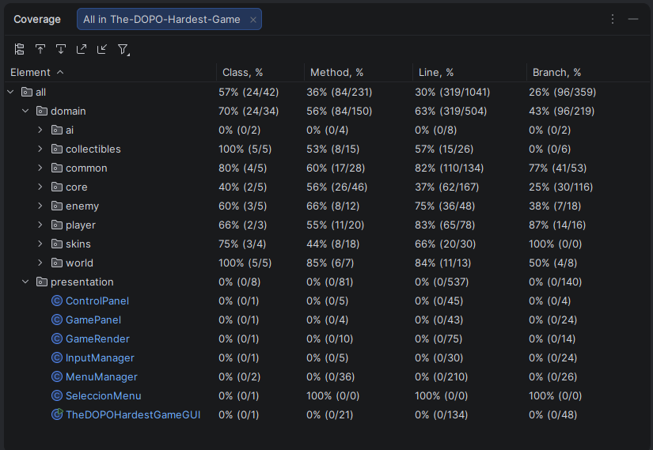
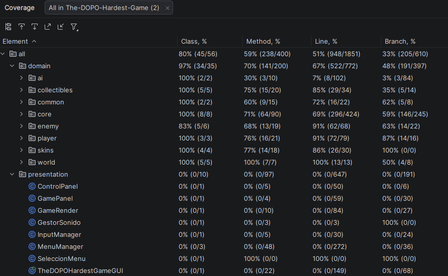

# The DOPO Hardest Game

Proyecto final de DOPO 2026-1  
**Autores:** Natalia Andrea Rodriguez Torres & Daniel Jose Villamizar Castellanos

---

## Descripción general

Implementación en Java del videojuego *The World's Hardest Game* con mecánicas propias, modos de juego extendidos e implementacion de los modos: un jugador, dos jugadores, maquina vs jugador. El jugador debe cruzar un nivel lleno de enemigos, recolectar todas las monedas y llegar a la zona de meta sin ser eliminado.

---

## Temas de clase implementados

| Tema | Dónde se aplica |
|---|---|
| **Herencia** | `Acelerado extends Basico`, `ZonaFinal / ZonaInicial / ZonaIntermedia extends Zona`, `MonedaAmarilla / MonedaSkin extends Moneda` |
| **Polimorfismo** | `EstrategiaMovimiento` — cuatro estrategias distintas se tratan de forma uniforme; `ControlJugador` — humano e IA comparten la misma interfaz |
| **Interfaces** | `EstrategiaMovimiento` (movimiento de enemigos), `ControlJugador` (control del jugador) |
| **Clases abstractas** | `Elemento` — base común de todos los objetos del mundo con posición, dimensiones y HitBox |
| **Encapsulamiento** | Campos privados/protegidos con acceso por métodos; la capa `domain` no depende de `presentation` |
| **Excepciones** | `TheDopoHardestGameException` con métodos para cada tipo de error |
| **Colecciones** | `ArrayList` de enemigos, monedas, paredes, zonas y jugadores gestionados por `Nivel` |
| **GUI** | `TheDopoHardestGameGUI` que  implementa la capa de presentacion con Java Swing|

### Patrones de diseño

| Patrón | Implementación |
|---|---|
| **Strategy** | `EstrategiaMovimiento` con cuatro estrategias concretas: `Basico`, `Acelerado`, `DeslizadorVertical`, `Patrullero` |
| **Builder / Factory** | `ConstructorNivel` lee un archivo `.txt` y ensambla el objeto `Nivel` completo (zonas, enemigos, monedas, elementos, paredes) |
| **Separación por capas (MVC-like)** | Paquete `domain` sin dependencias de Swing; paquete `presentation` depende de `domain` pero no al revés |

### Inteligencia artificial

| Clase | Comportamiento |
|---|---|
| `MaquinaAleatoria` | Elige una dirección aleatoria en cada ciclo |
| `MaquinaExperta` | BFS sobre una cuadrícula de 20 px que esquiva paredes, recoge monedas en orden óptimo y llega a la zona de meta |

### Pruebas unitarias

- **Framework:** JUnit 5 (`junit-platform-console-standalone-1.10.2.jar`)
- **Total:** 81 pruebas — 81 pasadas
- **Clases de prueba:** `AITest`, `BasicoTest`, `CollectiblesTest`, `ConstructorNivelTest`, `DirectionTest`, `EstrategiaMovimientoTest`, `HitBoxTest`, `JugadorTest`, `MotorJuegoTest`, `NivelTest`, `TheDOPOHardestGameTest`

---

## Características del juego

### Modos de juego

| Modo | Descripción |
|---|---|
| **1 Jugador** | Un humano recorre el nivel solo |
| **Jugador vs Jugador (PvP)** | Dos humanos compiten desde extremos opuestos del nivel |
| **Jugador vs Máquina (PvM)** | Un humano contra una IA (Aleatoria o Experta) |

### Personajes (skins)

| Skin | Velocidad | Vidas | Tamaño |
|---|---|---|---|
| Blinky | Alta | 1 | Normal |
| Clyde | Normal | 3 | Normal |
| Inky | Alta | 1 | Grande |

### Tipos de enemigos

| Tipo | Color | Movimiento | Dificultad |
|---|---|---|---|
| Básico | Azul | Línea recta con rebote en las paredes | Baja |
| Patrullero | Azul | Trayectoria circular/ovalada | Media |
| Deslizador V | Rojo | Línea recta vertical con rebote en las paredes | Baja |
| Acelerado | Morado | Línea recta al doble de velocidad de los demas enemigos con rebote en las paredes | Alta |

### Coleccionables y elementos especiales

| Elemento | Efecto |
|---|---|
| Moneda amarilla | Obligatoria para completar el nivel |
| Moneda skin | Cambia a una skin para el jugador |
| Bomba | Elimina al jugador al contacto |
| Fuente de vida | Restaura una vida al jugador |

### Niveles

| Nivel | Tiempo | Características principales |
|---|---|---|
| 1 | 90 s | Corredor único, 4 básicos + 1 patrullero, 4 monedas |
| 2 | 75 s | Zigzag con checkpoint, deslizador vertical, moneda skin |
| 3 | 60 s | Dos pasillos paralelos, acelerados, bomba y fuente de vida |

### Sistema de guardado

El juego permite guardar y cargar partida desde la pantalla de pausa o victoria. La partida se almacena en `resources/saves/partida.txt` en formato clave=valor.

---

## Estructura del proyecto

```
The-DOPO-Hardest-Game/
├── src/
│   ├── domain/
│   │   ├── ai/           # MaquinaAleatoria, MaquinaExperta (BFS)
│   │   ├── collectibles/ # Moneda, MonedaAmarilla, MonedaSkin, Bomba, FuenteDeVida
│   │   ├── common/       # Elemento (base), HitBox
│   │   ├── core/         # TheDOPOHardestGame, MotorJuego, Nivel, ConstructorNivel
│   │   ├── enemy/        # Enemigo, EstrategiaMovimiento, Basico, Acelerado, ...
│   │   ├── player/       # Jugador, ControlJugador, ControlHumano, Direction
│   │   ├── skins/        # Skin, Blinky, Clyde, Inky, ColorJuego
│   │   └── world/        # Zona, ZonaInicial, ZonaFinal, ZonaIntermedia, Pared
│   ├── presentation/     # GUI Swing: TheDOPOHardestGameGUI, MenuManager, GamePanel, ...
│   └── test/             # 11 clases de prueba JUnit 5
├── resources/
│   ├── configuraciones/  # nivel1.txt, nivel2.txt, nivel3.txt
│   └── saves/            # partida.txt (generado al guardar)
└── lib/
    └── junit-platform-console-standalone-1.10.2.jar
```

---
##   informe PMD:

**Herramienta:** PMD 7.23.0  
**Conjunto de reglas:** `rulesets/java/quickstart.xml`  
**Ámbito:** paquete `domain` y sus sub-paquetes (se excluye `presentation` porque el análisis estático de código Swing no aporta valor al dominio de negocio).

---

## 1. Introducción

Este informe documenta el análisis estático aplicado al proyecto TheDOPOHardestGame mediante la herramienta PMD. El objetivo es identificar violaciones de buenas prácticas en el código fuente de la capa de dominio, clasificarlas por tipo y archivo, y documentar las decisiones tomadas respecto a cada una.

---

## 2. Resultado del análisis

El análisis arrojó **107 violaciones** distribuidas en 18 archivos del paquete `domain`.

### Violaciones por regla

| Regla | Violaciones | Descripción |
|---|---|---|
| `ControlStatementBraces` | 66 | Sentencias `if/for/while` sin llaves explícitas |
| `OneDeclarationPerLine` | 20 | Múltiples declaraciones de variables en una sola línea |
| `PreserveStackTrace` | 6 | Se lanza una nueva excepción sin encadenar la causa original |
| `UnusedPrivateField` | 2 | Campos privados declarados pero nunca leídos |
| `UnusedPrivateMethod` | 2 | Métodos privados declarados pero nunca invocados |
| `UnusedFormalParameter` | 2 | Parámetros de método que no se usan en el cuerpo |
| `UncommentedEmptyMethodBody` | 2 | Cuerpos de método vacíos sin comentario explicativo |
| `LiteralsFirstInComparisons` | 2 | La literal debería ir a la izquierda del `equals` para evitar NPE |
| `ClassWithOnlyPrivateConstructorsShouldBeFinal` | 1 | Clase con constructores privados que podría declararse `final` |
| `ReturnEmptyCollectionRatherThanNull` | 1 | Se retorna `null` donde debería retornarse una colección vacía |
| `UselessParentheses` | 1 | Paréntesis innecesarios que no aportan claridad |
| `UncommentedEmptyConstructor` | 1 | Constructor vacío sin comentario que explique su propósito |
| `AvoidBranchingStatementAsLastInLoop` | 1 | `continue` como última instrucción de un bucle (equivale a no ponerlo) |

### Archivos con más violaciones

| Archivo | Violaciones |
|---|---|
| `TheDOPOHardestGame.java` | 31 |
| `MaquinaExperta.java` | 24 |
| `Nivel.java` | 10 |
| `ConstructorNivel.java` | 7 |
| `Basico.java` | 6 |
| `GestorArchivos.java` | 5 |
| `MotorJuego.java` | 5 |
| `Jugador.java` | 4 |
| `DeslizadorVertical.java` | 3 |
| Resto de archivos (9) | 12 |

---

## 3. Análisis de las violaciones

### `ControlStatementBraces` — 66 violaciones (62 % del total)

La gran mayoría de las violaciones corresponden a sentencias de control sin llaves. Esto es un patrón estilístico adoptado deliberadamente en el proyecto para mantener el código conciso en condiciones de una sola línea. Si bien PMD lo reporta como violación, el código es correcto y legible en su contexto. Se decide **no corregir** masivamente esta regla para no introducir ruido en el historial de cambios.

### `OneDeclarationPerLine` — 20 violaciones

Declaraciones del estilo `int x, y;` presentes principalmente en `MaquinaExperta` y clases de entidad (`Basico`, `DeslizadorVertical`, `Jugador`). Se trata de un estilo compacto para variables relacionadas (coordenadas, límites). Se decide **mantener** en los casos donde las variables son conceptualmente un par (ej. `dx, dy`).

### `PreserveStackTrace` — 6 violaciones (todas en `TheDOPOHardestGame`)

Al capturar una excepción y relanzar una `TheDopoHardestGameException`, no se pasa la causa original como argumento, perdiendo el stack trace. Esto dificulta el diagnóstico en producción. Se decide **corregir** estas 6 instancias encadenando la causa con `new TheDopoHardestGameException(mensaje, e)`.

### `UnusedPrivateField` — 2 violaciones (`Enemigo.velocidad`, `Enemigo.direccion`)

Campos declarados en `Enemigo` que nunca son leídos — el movimiento se delega a `EstrategiaMovimiento`. Son residuos de un diseño anterior. Se decide **eliminarlos**.

### `ReturnEmptyCollectionRatherThanNull` — 1 violación (`MaquinaExperta`)

El método de reconstrucción de ruta retorna `null` cuando no encuentra camino en lugar de una lista vacía. Esto obliga a los llamadores a comprobar `null`. Se decide **corregir** retornando `Collections.emptyList()`.

### `LiteralsFirstInComparisons` — 2 violaciones

Comparaciones del tipo `variable.equals("literal")` en lugar de `"literal".equals(variable)`. Si `variable` fuera `null`, se lanzaría un `NullPointerException`. Se decide **corregir** invirtiendo el orden.

### Violaciones menores aceptadas

Las violaciones de `UncommentedEmptyMethodBody`, `UncommentedEmptyConstructor`, `UselessParentheses`, `AvoidBranchingStatementAsLastInLoop` y `ClassWithOnlyPrivateConstructorsShouldBeFinal` se dejan como están: corresponden a stubs intencionales o detalles de estilo sin impacto en la corrección del programa.

---

## 4. Correcciones aplicadas

| Regla | Instancias corregidas | Archivos afectados |
|---|---|---|
| `PreserveStackTrace` | 6 | `TheDOPOHardestGame.java` |
| `UnusedPrivateField` | 2 | `Enemigo.java` |
| `ReturnEmptyCollectionRatherThanNull` | 1 | `MaquinaExperta.java` |
| `LiteralsFirstInComparisons` | 2 | `ConstructorNivel.java`, `GestorArchivos.java` |

Tras aplicar las correcciones el análisis reporta **96 violaciones**, correspondientes en su totalidad a decisiones de estilo aceptadas (`ControlStatementBraces`, `OneDeclarationPerLine`) o stubs intencionales.

---
---
##   informe test coverage:  
**Herramienta:** JaCoCo (runner integrado en IntelliJ IDEA)
---
## 1. Introducción
Este informe  documenta  el análisis dinámico aplicado  al  proyecto final TheDOPOHardestGame. Dicho
informe consiste  en  medir  la  cobertura  de código alcanzada  por  las  pruebas  unitarias  JUnit
mediante la herramienta JaCoCo.
---
El objetivo establecido es superar el 75% de cobertura sobre el código de dominio. Este informe
presenta el resultado inicial obtenido antes de cualquier mejora, el análisis de los resultados, las
decisiones tomadas y el resultado final alcanzado.
---
## 2. Resultado Inicial
Al ejecutar las pruebas unitarias se obtuvo el siguiente resultado:


> La capa `presentation` (código Swing/GUI) se excluye del análisis porque no es comprobable con tests unitarios. La cobertura reportada corresponde al paquete `domain` y sus sub-paquetes.
---
## Analisis

## Cobertura por paquete — Instrucciones

| Paquete | Antes | Después | Δ |
|---|---|---|---|
| `domain.ai` | 0% | **98%** | +98 pp |
| `domain.core` | 35% | **97%** | +62 pp |
| `domain.enemy` | 67% | **90%** | +23 pp |
| `domain.collectibles` | 61% | **91%** | +30 pp |
| `domain.player` | 84% | **95%** | +11 pp |
| `domain.skins` | 81% | **94%** | +13 pp |
| `domain.world` | 92% | **98%** | +6 pp |
| `domain.common` | 86% | **87%** | +1 pp |
| `presentation` | 0% | 0% | — (no aplica) |

---

## Cobertura por paquete — Ramas (branches)

| Paquete | Antes | Después | Δ |
|---|---|---|---|
| `domain.ai` | 0% | **100%** | +100 pp |
| `domain.core` | 25% | **83%** | +58 pp |
| `domain.enemy` | 38% | **72%** | +34 pp |
| `domain.collectibles` | 0% | **66%** | +66 pp |
| `domain.player` | 87% | **87%** | = |
| `domain.common` | 77% | **77%** | = |
| `domain.world` | 50% | **50%** | = |

---

### Clases que pasaron de 0% a cobertura significativa

| Clase | Antes | Después | Tests que la cubren |
|---|---|---|---|
| `TheDOPOHardestGame` | 0% | **95%** | `TheDOPOHardestGameTest` |
| `MaquinaAleatoria` | 0% | **98%** | `AITest` |
| `MaquinaExperta` | 0% | **100%** | `AITest` |
| `DeslizadorVertical` | 0% | **~90%** | `EstrategiaMovimientoTest` |
| `Patrullero` | 0% | **100%** | `EstrategiaMovimientoTest` |
| `FuenteDeVida` | 30% | **100%** | `CollectiblesTest`, `MotorJuegoTest` |

### Clases que ya tenían cobertura y se completaron

| Clase | Antes | Después |
|---|---|---|
| `Nivel` | 89% | **100%** |
| `MotorJuego` | 60% | **98%** |
| `Jugador` | 84% | **95%** |
| `Enemigo` | 92% | **100%** |
| `EstadoJuego` | — | **100%** |
| `ModoJuego` | — | **100%** |
| `ZonaIntermedia` | 63% | **100%** |

---

## Tests añadidos

### Archivos nuevos (4)

#### `AITest.java` — 4 tests
Cubre `MaquinaAleatoria` y `MaquinaExperta`, ambas en 0% antes.
- Primer llamado a `decidirMovimiento` (activa elección aleatoria)
- Llamados subsiguientes (mantiene dirección mientras tiene pasos)
- Agotamiento de pasos y re-elección de dirección
- `MaquinaExperta` retorna `Direction.QUIETO`

#### `EstrategiaMovimientoTest.java` — 4 tests
Cubre `DeslizadorVertical` y `Patrullero`, ambos en 0% antes.
- Descenso inicial del deslizador
- Rebote al llegar a `maxY`
- Rebote al llegar a `minY`
- `Patrullero.actualizar()` es un stub sin efecto

#### `CollectiblesTest.java` — 7 tests
Cubre `FuenteDeVida`, `MonedaSkin`, `Bomba`, `Clyde.aplicarPenalizacionGolpe` e `Inky`.
- `FuenteDeVida` solo se activa una vez aunque se llame dos veces
- `MonedaSkin` guarda y expone su skin otorgada
- `Bomba` está activa al crearse; `explotar()` es un stub seguro
- `Clyde` reduce su velocidad tras recibir un golpe
- `Inky` tiene velocidad, tamaño y color correctos

#### `TheDOPOHardestGameTest.java` — 29 tests
Cubre `TheDOPOHardestGame` (422 instrucciones, 0% → 95%) y `GestorArchivos`.
- Estado inicial antes de `iniciar()`
- Los tres modos de juego: `PLAYER`, `PvsP`, `PvsM`
- Spawning de jugadores con skin/color por defecto cuando no se proveen suficientes
- Excepciones al pasar `modo=null`, `skins=null` o skins vacías
- `actualizarJuego()` cuando no está en modo `JUGANDO` (retorno temprano)
- Transición a `DERROTA` al superar el tiempo límite
- `pausar()` y `reanudar()` dentro y fuera de su estado válido
- `terminar()` vuelve a `MENU`
- `reiniciar()` recarga el nivel correctamente
- `avanzarNivel()` rota nivel1 → nivel2 → nivel3 → nivel1
- Getters: `obtenerNivelId()`, `obtenerTiempoRestante()`, `getModo()`

---

### Archivos existentes ampliados (3)

#### `MotorJuegoTest.java` — 4 → 9 tests (+5)
Nuevas ramas cubiertas en `procesarInteracciones`:
- Recolección de `MonedaSkin` (cambia skin del jugador)
- Activación de `FuenteDeVida` (otorga escudo)
- Explosión de `Bomba` (mata jugador y reinicia monedas)
- `ZonaIntermedia` actualiza el punto de respawn
- Colisión PvsP mata a ambos jugadores

#### `NivelTest.java` — 3 → 5 tests (+2)
- `Nivel.actualizar()` mueve a los enemigos
- `Nivel.reset()` reinicia las monedas pendientes

#### `JugadorTest.java` — 7 → 9 tests (+2)
- `setRespawn()` cambia el punto de reaparición correctamente
- `agregarEscudo()` incrementa las vidas

---
## 3. Resultado Final

## Resumen 

| Métrica | Antes | Después | Cambio |
|---|---|---|---|
| Tests totales | 28 | 71 | +43 |
| Archivos de test | 7 | 11 | +4 nuevos |
| Cobertura de clases | ~57% | **~80%** | **+23 pp** |


---


## Metodología

Se usó **JaCoCo** integrado en IntelliJ IDEA como runner de cobertura. Los tests usan **JUnit 5** (`junit-platform-console-standalone-1.10.2`).

Criterios aplicados al escribir los tests:
- **Solo se probó lo que realmente faltaba** — no se duplicaron tests existentes.
- **Se priorizó por impacto** — primero las clases al 0%, luego las ramas no cubiertas.
- **No se testeó la capa `presentation`** — código Swing/GUI no es comprobable con tests unitarios estándar.
---
## Guía de comandos — ejecutar desde consola

> **Requisito:** JDK 21 o superior instalado y en el PATH.  
> Todos los comandos se ejecutan desde la raíz del repositorio.

### 1. Clonar el repositorio

```bash
git clone <url-del-repositorio>
cd The-DOPO-Hardest-Game
```

### 2. Compilar el juego

**Linux / macOS (bash):**
```bash
mkdir -p out
find src -name "*.java" ! -path "*/test/*" > sources.txt
javac -cp lib/junit-platform-console-standalone-1.10.2.jar -d out @sources.txt
```

**Windows (PowerShell):**
```powershell
New-Item -ItemType Directory -Force out | Out-Null
Get-ChildItem -Recurse -Path src -Filter "*.java" |
    Where-Object { $_.FullName -notlike "*\test\*" } |
    Select-Object -ExpandProperty FullName |
    Out-File -Encoding utf8 sources.txt
javac -cp "lib/junit-platform-console-standalone-1.10.2.jar" -d out "@sources.txt"
```

### 3. Ejecutar el juego

**Linux / macOS:**
```bash
java -cp out presentation.TheDOPOHardestGameGUI
```

**Windows (PowerShell):**
```powershell
java -cp out presentation.TheDOPOHardestGameGUI
```

### 4. Compilar incluyendo los tests

**Linux / macOS:**
```bash
find src -name "*.java" > sources_all.txt
javac -cp lib/junit-platform-console-standalone-1.10.2.jar -d out @sources_all.txt
```

**Windows (PowerShell):**
```powershell
Get-ChildItem -Recurse -Path src -Filter "*.java" |
    Select-Object -ExpandProperty FullName |
    Out-File -Encoding utf8 sources_all.txt
javac -cp "lib/junit-platform-console-standalone-1.10.2.jar" -d out "@sources_all.txt"
```

### 5. Ejecutar los tests

**Linux / macOS:**
```bash
java -cp out:lib/junit-platform-console-standalone-1.10.2.jar \
     org.junit.platform.console.ConsoleLauncher \
     --scan-classpath \
     --include-package test
```

**Windows (PowerShell):**
```powershell
java -cp "out;lib/junit-platform-console-standalone-1.10.2.jar" `
     org.junit.platform.console.ConsoleLauncher `
     --scan-classpath `
     --include-package test
```

---

## Controles

| Tecla | Acción |
|---|---|
| `W / A / S / D` | Mover J1 (arriba / izquierda / abajo / derecha) |
| `↑ ↓ ← →` | Mover J2 (en modos multijugador) |
| `ESC` | Pausar / reanudar |
| `S` (en pausa) | Guardar partida |
| `R` | Reiniciar nivel |
| `N` (victoria) | Siguiente nivel |
| `M` | Volver al menú |
| `Q` | Salir del juego |

